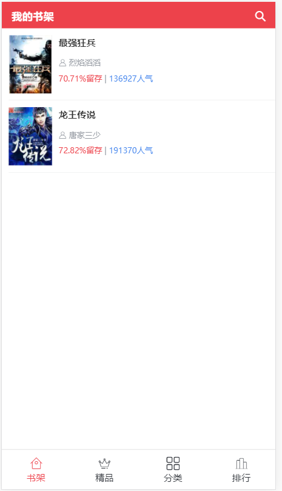
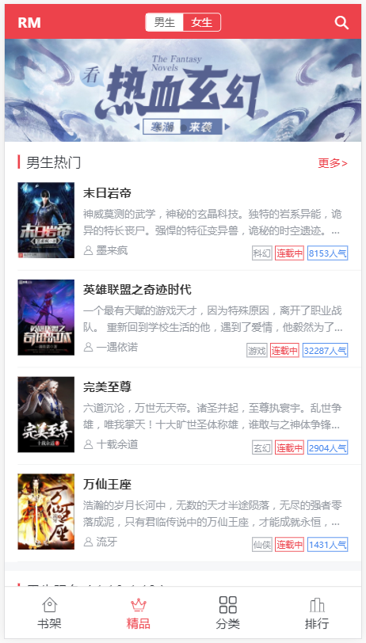
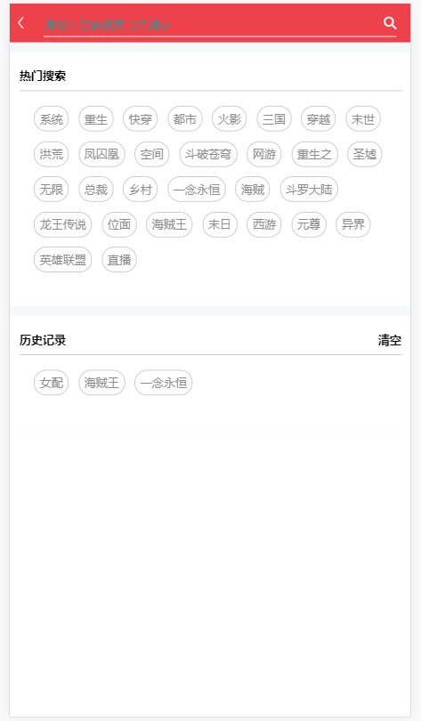
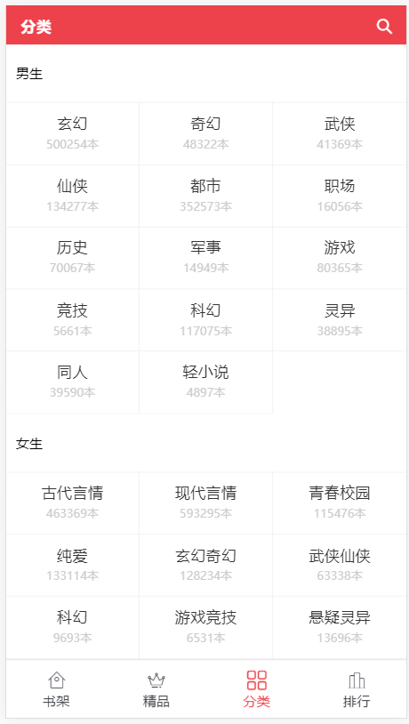
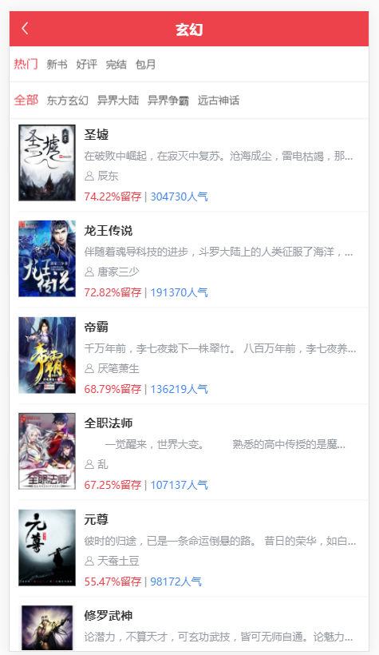
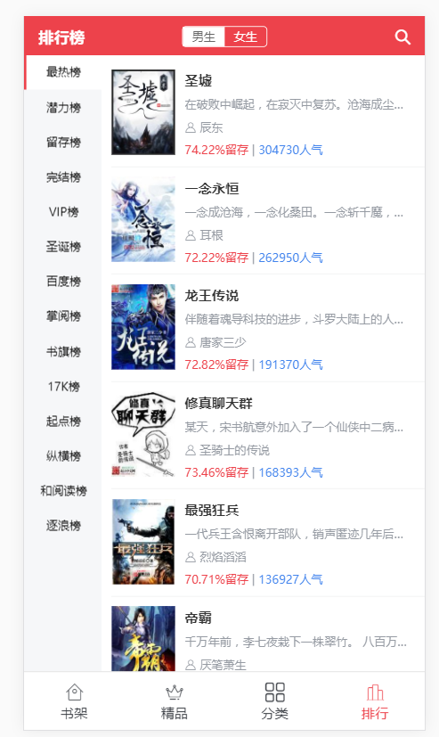
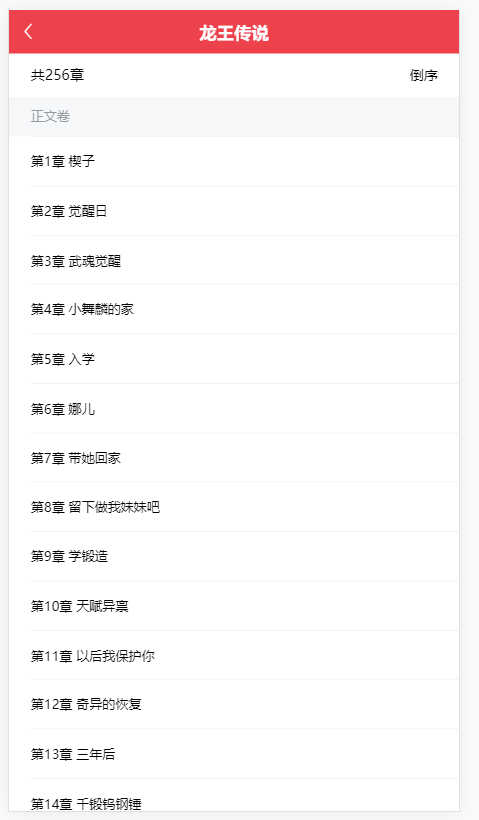
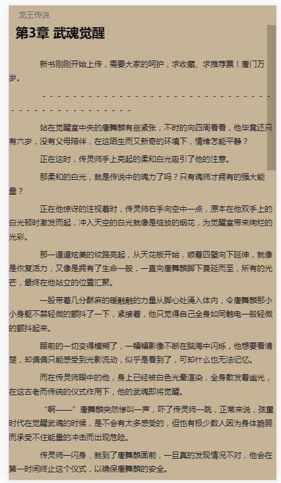

# 基于vue的小说阅读webapp

## 第一次是用angular4写的，然后用vue又重写了一遍

### 预览

    
   
   
   
   
   
   
   

### 总结
 这个项目采用vue+vuex+vue-router+axios+pug+sass构建，项目难度并不大，很适合初学者学习。完整走了一遍vue全家桶，感觉很是酸爽。大家clone下来，安装完依赖就可以运行了，反向代理已经配置完毕了，我用angular的写的地址：[追书神器](https://github.com/hellowolrds/book)，这个还有一点没完善。不过已经完成了百分之七十了。待我有时间继续完善。
 
 这个项目得配置反向代理，虚拟主机是没办法配置反向代理，我就没放到我的空间里。所以有云主机的同学，可以在apache或nginx上配置反向代理，网上应该都有说明。
